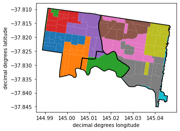

# Summary

The Australian Bureau of Statistics (ABS) publishes a variety of indexes for the Australian
economic environment. These include the Consumer Price Index (CPI) used for calculating inflation
and a variety of indexes designed to measure socio-economic advantage. `ausdex` makes these data
available in a convenient Python package with a simple programatic and command line interfaces. 

# Statement of need

`ausdex` is a Python package for querying data produced by the Australian Bureau of Statistics (ABS) and returning them in a convenient format.

# Socio-Economic Indices aggregated from census data for Victoria

Since the 1986 census, the Australian Bureau of statistics (ABS) has generated "Socio-Economic Indices For Areas" (SEIFA) following each census[@seifa2016]. These indices are aggregations of socio-economic inputs from the census forms (ie household income, rental/mortgage price, educational level) at teh "census district level" or "mesh level" (2006–current). census districts, or mesh levels, geographic areas statistically defined from the census data to be the largest scale (smallest) geographic building blocks of demographic and socio-economic data based on population distribution. The Australian Bureau of statistics does aggregate these to other statistical "levels" of geographic area as well as suburbs and local government areas in their "Data Cube" outputs.

However, there have been several new suburbs created during the duration of the SEIFA program. To address this, we used the current suburb areal polygons as the constant spatial areas over which we aggregate previous census datasets. For the 2011 and 2016 SEIFA datasets, we used suburb aggregated data provided by the ABS.

## Spatially aggregating the 1986–2006 datasets

For the SEIFA datasets from 1986 to 2006, we collected census district polygons from AURIN[@sinnott2016] (1986–2001) and the ABS data repository (2006), along with associated aggregated SIEFA scores. These census district level SEIFA scores were aggregated to the current suburb GIS datasets using the following steps:

1. Suburbs and census districts were both reprojected to [EPSG:4326](https://spatialreference.org/ref/epsg/wgs-84/).
2. The polygons were unioned together, so the resulting polygon layer had an individual polygon for each overlapping census district and suburb (Figure 1).

3. The merged polygons were reprojected to a utm projected coordinate system [EPSG:32756](https://epsg.io/32756). Note that this utm coordinate system does not overlay the state of victoria perfectly, but we are assuming that locally the measured areas are relatively accurate to each other.

4. The SEIFA scores were aggregated for all of the census district parts within each suburb using a weighted average, with the polygon area as the weight.

 Figure 1: Map of three suburb outlines (black lines) for Richmond (left), Burnley (center), and Hawthorn (right) overlaying 1986 Census Districts (colored polygons with white boundaries). The census districts are colored according to the census district code. Note that these districts do not line up with subur boundaries. the green district in the lower middle section falls in parts of Richmond, and cremorne. Likewise one of the Orange and Purple Census districts spans two suburbs.

# Inflation

The Consumer Price Index (CPI) is a weighted average price of a basket of goods and services for urban consumers.[@ABS_CPI_Methods] The ABS issues to the Australian CPI [every quarter](https://www.abs.gov.au/statistics/economy/price-indexes-and-inflation/consumer-price-index-australia). The data are available from September 1948 onwards. To adjust prices for inflation, we can assume that the ratio of prices for two dates is equal to ratio of the CPIs for those dates.[@parkin_macroeconomics_2019, p. 188] This gives the formula:

$$ \textrm{Price at time B} = \textrm{Price at time A} \times \frac{\textrm{CPI at time B}}{\textrm{CPI at time A}} $$

`ausdex` automates the process for downloading the latest version of the Australian CPI data from the ABS. The user gives the interface a price, the original date ($A$) and the evaluation date ($B$) and it returns the adjusted price. The inputs can be scalar values or a vectors as a NumPy array or a pandas series. The size of the returned vector of prices is the same as the size of the original prices. If the original date or the evaluation dates are vectors instead of scalar values then these must be the same size as the vector of prices. Several validation scenario are in the automated tests and these have been compared with the Reserve Bank of Australia's [inflation calculator](https://www.rba.gov.au/calculator/).

# Module Features

The components of the module work both from a simple command-line interface and as a Python module. The code works seamlessly with NumPy[@harris2020array] and Pandas[@mckinney-proc-scipy-2010]. The code style adheres to PEP 8[@pep8] through the use of the [Black](https://black.readthedocs.io/en/stable/) Python code formatter. Automated tests run as part of the CI/CD pipeline and testing coverage is above 96%. The package is thoroughly documented at [https://rbturnbull.github.io/ausdex/](https://rbturnbull.github.io/ausdex/). 

# Acknowledgements

This project came about through a research collaboration with Vidal Paton-Cole and Robert Crawford (University of Melbourne). We acknowledge the support of our colleagues at the Melbourne Data Analytics Platform: Aleksandra Michalewicz and Emily Fitzgerald.

# References

