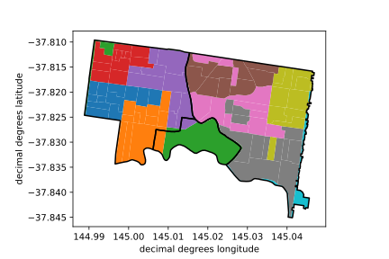

# Summary

The Australian Bureau of Statistics (ABS) publishes a variety of indexes for the Australian
economic environment. These include the Consumer Price Index (CPI) used for calculating inflation
and a variety of indexes designed to measure socio-economic advantage. `ausdex` makes these data
available in a convenient Python package with a simple programatic and command line interfaces. 

# Statement of need

`ausdex` is a Python package for querying data produced by the Australian Bureau of Statistics (ABS) and returning them in a convenient format. Currently ABS data is housed typically in Excel spreadsheets linked from the data catalogue. This package attempts to interface with a subset of the the data in order to provide an API to derived socio-economic metrics. Additionally, we provide an interface to the Australia Consumer Price Index to adjust prices for inflation.

# Socio-Economic Indices aggregated from census data for Victoria
Since the 1986 census, the ABS has generated "Socio-Economic Indexes For Areas" (SEIFA) following each census[@seifa2016]. These indices are aggregations of socio-economic inputs from the census forms (ie household income, rental/mortgage price, educational level) at the "census district level" or "mesh level" (2006–current). census districts, or mesh levels, geographic areas statistically defined from the census data to be the largest scale (smallest) geographic building blocks of demographic and socio-economic data based on population distribution. These statistical geographies are redrawn after every census. The Australian Bureau of Statistics does aggregate these to other statistical "levels" of geographic area from the Australian Statistical Geography Standard (ASGS) ([Statistical Areas Levels 1–4](https://www.abs.gov.au/statistics/standards/australian-statistical-geography-standard-asgs-edition-3/jul2021-jun2026)) suburbs and local government areas in their "Data Cube" outputs. 

However, there have been several new suburbs created during the duration of the SEIFA program, and suburb aggregated datasets are not readily available for census data before 2006.  To address this, we used the current Victorian suburb areal polygons [@vic_suburbs] as the constant spatial areas over which we aggregate all previous census datasets. In order to overcome suburb names that are repeated. The suburb polygons were also overlain with local government areas [@vic_lga] to make duplicate suburbs distinct.

## List of SEIFA Indices

| Index | Name | Years Published |
| :---- | :------------ | :-------------- |
| IEO | Index of Education and Occupation | 1986, 1991, 1996, 2001, 2006, 2011, 2016 |
| IER | Index of Economic Resources | 1986, 1991, 1996, 2001, 2006, 2011, 2016 |
| IRSD | Index of Relative Socio-economic Disadvantage | 2006, 2011, 2016 |
| IRSAD | Index of Relative Socio-economic Advantage and Disadvantage | 2001, 2006, 2011, 2016 |
| UIRSA | Urban Index of Relative Socio-economic Advantage | 1991, 1996 |
| RIRSA | Rural Index of Relative Socio-economic Advantage | 1991, 1996 |

## Spatially aggregating the 1986–2006 datasets

For the SEIFA datasets from 1986 to 2006, we collected census district polygons from AURIN [@aurin_portal] and the ABS data repository (2006), along with associated aggregated SIEFA scores. These census district level SEIFA scores were aggregated to the current suburb GIS datasets [@vic_suburbs] using the following steps:

1. Suburbs and census districts were both reprojected to [EPSG:4326](https://spatialreference.org/ref/epsg/wgs-84/).
2. The polygons were unioned together, so the resulting polygon layer had an individual polygon for each overlapping census district and suburb (Figure 1).

3. The merged polygons were reprojected to a UTM projected coordinate system [EPSG:32756](https://epsg.io/32756). Note that this UTM coordinate system does not overlay the state of Victoria perfectly, but we are assuming that locally the measured areas are relatively accurate to each other.

4. The SEIFA scores were aggregated for all of the census district parts within each suburb using a weighted average, with the polygon area as the weight.

 Figure 1: map of three suburb outlines (black lines) for Richmond (left), Burnley (center), and Hawthorne (right) overlaying 1986 Census Districts (colored polygons with white boundaries). The census districts are colored according to the census district code. Note that these districts do not line up with subur boundaries. the green district in the lower middle section falls in parts of Richmond, and cremorne. Likewise one of the Orange and Purple Census districts spans two suburbs.

## Spatially aggregating the 2011 and 2016 datasets

For the 2011 and 2016 datasets, we used the same outline above, but started with a different statistical geographic dataset. We used statistical srea one (SA1) aggregated estimates of the SEIFA variables published as an ABS data cube, and GIS polygons of SA1 boundaries from the ASGS created for 2011 and 2016 to derive suburb aggregated datasets.

## List of data sources for seifa vic submodule

| year | dataset type | dataset source |
| :---- | :------------ | :-------------- |
| 1986 | census district polygons and metrics | [@aurin_portal] wfs id: `AU_Govt_ABS-UoM_AURIN_DB_3_seifa_cd_1986`| 
| 1991 | census district polygons and metrics | [@aurin_portal] wfs id: `AU_Govt_ABS-UoM_AURIN_DB_3_seifa_cd_1991`|
| 1996 | census district polygons and metrics | [@aurin_portal] wfs id: `AU_Govt_ABS-UoM_AURIN_DB_3_seifa_cd_1996`|
| 2001 | census district polygons and metrics | [@aurin_portal] wfs id: `AU_Govt_ABS-UoM_AURIN_DB_3_seifa_cd_2001`|
| 2006 | ABS census district shapefile| [@abs_2006_cd_shape] [download link](https://www.abs.gov.au/AUSSTATS/subscriber.nsf/log?openagent&1259030002_cd06avic_shape.zip&1259.0.30.002&Data%20Cubes&D62E845F621FE8ACCA25795D002439BB&0&2006&06.12.2011&Previous)|
| 2006 | ABS census district seifa metrics | [@abs_2016_seifa]  [download link](https://www.abs.gov.au/AUSSTATS/subscriber.nsf/log?openagent&2033055001_%20seifa,%20census%20collection%20districts,%20data%20cube%20only,%202006.xls&2033.0.55.001&Data%20Cubes&6EFDD4FA99C28C4ECA2574170011668A&0&2006&26.03.2008&Latest)|
| 2011 | ABS SA1 Polygons | [@abs_2011_sa1_shape] [download link](https://www.abs.gov.au/ausstats/subscriber.nsf/log?openagent&1270055001_sa1_2011_aust_shape.zip&1270.0.55.001&Data%20Cubes&24A18E7B88E716BDCA257801000D0AF1&0&July%202011&23.12.2010&Latest)|
| 2011 | ABS SA1 seifa metrics | [@abs_2016_seifa] [download link](https://www.abs.gov.au/AUSSTATS/subscriber.nsf/log?openagent&2033.0.55.001%20sa1%20indexes.xls&2033.0.55.001&Data%20Cubes&9828E2819C30D96DCA257B43000E923E&0&2011&05.04.2013&Latest)|
| 2016 | ABS SA1 Polygons | [@abs_2016_sa1_shape]  [download link](https://www.abs.gov.au/AUSSTATS/subscriber.nsf/log?openagent&1270055001_sa1_2016_aust_shape.zip&1270.0.55.001&Data%20Cubes&6F308688D810CEF3CA257FED0013C62D&0&July%202016&12.07.2016&Latest)|
| 2016 | ABS SA1 seifa metrics | [@abs_2016_seifa] [download link](https://www.abs.gov.au/ausstats/subscriber.nsf/log?openagent&2033055001%20-%20sa1%20indexes.xls&2033.0.55.001&Data%20Cubes&40A0EFDE970A1511CA25825D000F8E8D&0&2016&27.03.2018&Latest)|
| all | VicMap suburb polygons| [@vic_suburbs] [download link](https://data.gov.au/geoserver/vic-suburb-locality-boundaries-psma-administrative-boundaries/wfs?request=GetFeature&typeName=ckan_af33dd8c_0534_4e18_9245_fc64440f742e&outputFormat=json)|
| all | VicMap Local Government Area Polygons| [@vic_lga]  [download link](https://data.gov.au/geoserver/vic-local-government-areas-psma-administrative-boundaries/wfs?request=GetFeature&typeName=ckan_bdf92691_c6fe_42b9_a0e2_a4cd716fa811&outputFormat=json)|
 

# Inflation

The Consumer Price Index (CPI) is a weighted average price of a basket of goods and services for urban consumers [@ABS_CPI_Methods]. The ABS issues to the Australian CPI [every quarter](https://www.abs.gov.au/statistics/economy/price-indexes-and-inflation/consumer-price-index-australia). The data are available from September 1948 onwards. The CPI values before decimalization of the Australian currency on Febrary 14, 1966 are in understood according to the conversion rates specified in the 1965 Year Book of Australia such that £1 is equivalent to $2 [@yearbook1965, p. 810].

To adjust prices for inflation, we can assume that the ratio of prices for two dates is equal to ratio of the CPIs for those dates.[@parkin_macroeconomics_2019, p. 811] This gives the formula:

$$ \textrm{Price at time B} = \textrm{Price at time A} \times \frac{\textrm{CPI at time B}}{\textrm{CPI at time A}} $$

The `ausdex` package automates the process for downloading the latest version of the Australian CPI data from the ABS. The user gives the interface a price, the original date ($A$) and the evaluation date ($B$) and it returns the adjusted price. The inputs can be scalar values or a vectors as a NumPy array or a pandas series. The size of the returned vector of prices is the same as the size of the original prices. If the original date or the evaluation dates are vectors instead of scalar values then these must be the same size as the vector of prices. Several validation scenario are in the automated tests and these have been compared with the Reserve Bank of Australia's [inflation calculator](https://www.rba.gov.au/calculator/).

# Module Features
The components of the module work both from a simple command-line interface and as a Python module. The code works seamlessly with NumPy [@harris2020array] and Pandas [@mckinney-proc-scipy-2010]. The code style adheres to PEP 8 [@pep8] through the use of the [Black](https://black.readthedocs.io/en/stable/) Python code formatter. Automated tests run as part of the CI/CD pipeline and testing coverage is above 96%. The package is thoroughly documented at [https://rbturnbull.github.io/ausdex/](https://rbturnbull.github.io/ausdex/). 

# Acknowledgements

This project came about through a research collaboration with Vidal Paton-Cole and Robert Crawford (University of Melbourne). We acknowledge the support of our colleagues at the Melbourne Data Analytics Platform: Aleksandra Michalewicz and Emily Fitzgerald.

This app uses the NCRIS-enabled Australian Urban Research Infrastructure Network (AURIN) Portal e-Infrastructure to access the following datasets:  

* AU_Govt_ABS-UoM_AURIN_DB_3_seifa_cd_1986,
* AU_Govt_ABS-UoM_AURIN_DB_3_seifa_cd_1991, 
* AU_Govt_ABS-UoM_AURIN_DB_3_seifa_cd_1996,
* AU_Govt_ABS-UoM_AURIN_DB_3_seifa_cd_2001.

# References

